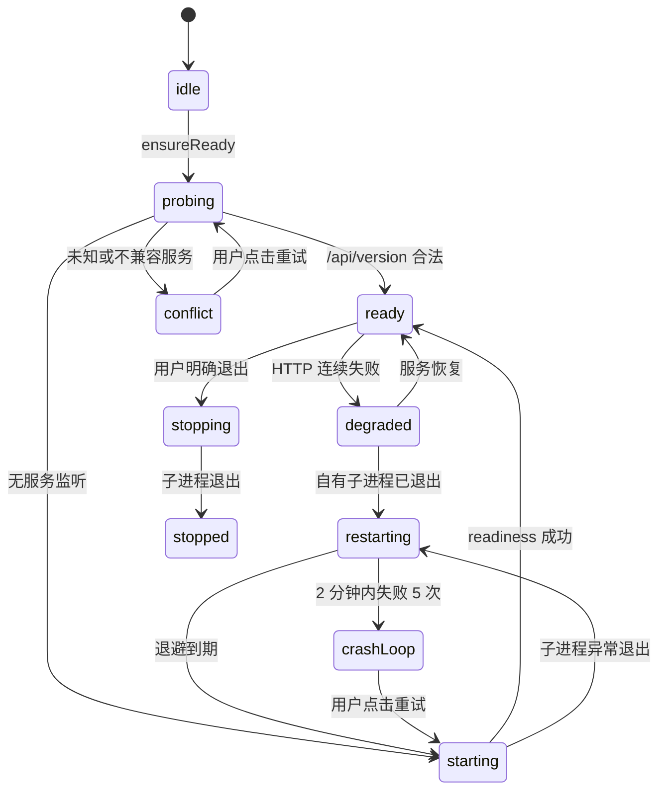
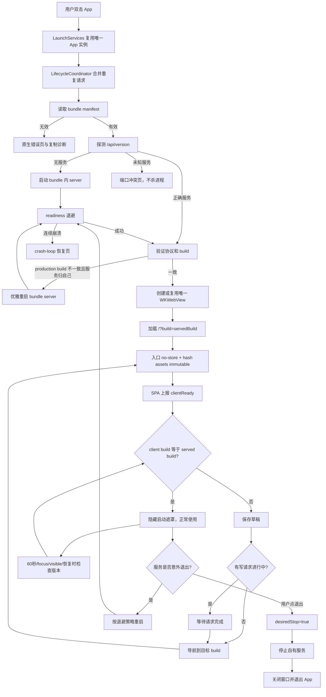

# SummitWorkbench 面板生命周期、版本一致性与 macOS 原生壳实施文档

> 状态：方案已确认，等待实现  
> 编写日期：2026-09-03  
> 目标运行环境：用户主机 macOS 26.1；产品最低目标建议 macOS 13.0  
> 主要读者：负责实际编码的 Codex Luna 或同等级实现模型  
> 关联问题：双击 `SummitWorkbench.app` 后 Chrome App Mode 复用旧窗口，长期显示旧 SPA  
> 实施原则：按本文阶段顺序完成；每阶段单独验证、单独提交；不要跳过契约测试

---

## 0. 给实现模型的执行说明

本文是实现规格，不是泛泛建议。实现者开始编码前必须先完整阅读本文，然后按 Phase 0 →
Phase 5 顺序执行。

必须遵守以下边界：

1. 不要重新诊断根因。根因已经由实际进程、启动参数和静态产物取证确认：固定
   `--user-data-dir` 下的 Chrome App Mode 窗口被复用，但旧页面从未整页导航。
2. 不要根据机器上存在 `SummitKnowledge.app`、`SummitServerAI.app` 或其他相似名字的软件，
   推断用户打开了错误应用。只能依据 SummitWorkbench 的端口、进程参数、服务身份响应和窗口
   客户端版本判断。
3. 不要要求用户执行 CLI、手动清缓存、打开 DevTools 或按强制刷新快捷键。所有恢复必须由
   App、服务端和 SPA 自动完成。
4. 不要使用 AppleScript 作为正式实现，不要引入 Chrome DevTools Protocol。最终生产窗口由
   `WKWebView` 承载；Chrome 只保留到 Phase 3 完成前的临时迁移路径或开发回滚开关。
5. 不要用端口可连接代替服务就绪。服务就绪的唯一判据是 `/api/version` 返回正确
   `product_id`、兼容 `api_protocol` 和合法 build 信息。
6. 不要用 Chrome PID 是否早于服务启动时间作为版本一致性的结论。版本一致性必须比较
   `client_build` 与 `served_frontend_build`。
7. 不要删除 Chrome profile 的 `SingletonLock`。需要迁移旧窗口时只结束经过严格校验的专用
   Chrome 主进程，并让 Chrome 自己清理锁。
8. 不要覆盖或回退工作区中与本任务无关的用户改动。开始每个阶段前先运行
   `git status --short` 并记录基线。
9. `src/summit_workbench/webapp/static/` 是提交进仓库的构建产物。前端源码改动后必须执行构建，
   并提交对应的静态资源增删。
10. 每个阶段完成后先运行该阶段的定向测试，再运行完整质量门；只有全绿才能进入下一阶段。

---

## 1. 最终目标与可验证结果

### 1.1 用户语义

用户双击或重新打开 `SummitWorkbench.app` 的固定语义为：

```text
确保正确的 SummitWorkbench 服务运行
→ 确保服务已经伺服完整且可识别的前端构建
→ 确保唯一面板窗口加载该构建
→ 将窗口带到前台
```

用户不需要知道后端、profile、缓存、PID 或 build hash。

### 1.2 最终验收标准

以下项目全部满足才算任务完成：

- [ ] 冷启动时服务未就绪前不加载远程页面，不出现 Chrome/WKWebView 连接失败页。
- [ ] 运行旧 SPA 的窗口在新构建部署后能够自动发现版本不一致并自愈。
- [ ] 再次双击 App 后，2 秒内开始版本校验；服务正常时只展示一个面板窗口。
- [ ] 用户有未提交输入时，更新不会静默丢失草稿。
- [ ] 非幂等写请求进行中时，不在请求中途刷新页面。
- [ ] 服务被意外终止后 App 不自杀，而是按退避策略自动恢复。
- [ ] 用户点击“退出”时，App 能区分这是明确退出，不会再次拉起服务。
- [ ] 8787 被未知服务占用时不杀未知进程，并显示可理解的原生错误界面。
- [ ] 面板显示前端构建、服务版本和同步状态。
- [ ] 日志能还原冷启动、重开、服务重启、版本检查、刷新和失败原因。
- [ ] 生产模式不依赖 Google Chrome、AppleScript、DevTools 或仓库 `.venv`。
- [ ] 最终 `.app` 包含自己的后端运行时和同一版本的静态资源。
- [ ] 在当前用户主机 macOS 26.1 上完成真实打包验收。

### 1.3 非目标

本任务不处理：

- 业务页签内容、审批语义、第二大脑回答质量；
- 远程部署、多用户认证和公网服务；
- iOS/iPadOS；
- 自动在线升级框架（例如 Sparkle）。本文只保证已安装构建内部的一致性；自动下载下一版本可另立项目。

---

## 2. 当前状态与必须修正的事实

### 2.1 当前启动器

文件：`scripts/summit_launcher.swift`

当前行为：

1. `applicationDidFinishLaunching` 先调用 `openPanel()`，然后才调用
   `startServerIfNeeded()`；
2. Chrome 固定使用 `--app=http://127.0.0.1:8787/`；
3. Chrome 固定使用
   `~/Library/Application Support/SummitWorkbench/browser`；
4. `applicationShouldHandleReopen` 只再次执行相同 Chrome 命令；
5. 健康检查只是 TCP connect；
6. 服务成功运行过以后，只要连续约 8 秒不可达，启动器就退出。

这六项必须全部改变。

### 2.2 当前前端

文件：`web/src/main.ts`

当前行为：

- SPA 每 60 秒调用 `/api/state`；
- `/api/state` 只更新业务数据；
- SPA 不知道自己的构建 ID；
- 没有服务器实例 ID；
- 没有版本不一致处理；
- 快速捕捉、问答草稿、审批编辑框等存在潜在刷新丢失风险。

### 2.3 当前后端

文件：`src/summit_workbench/webapp/app.py`

当前行为：

- `/` 已设置 `Cache-Control: no-cache`；
- `/api/state` 不返回 build 信息；
- 没有轻量 readiness/version 端点；
- `/api/shutdown` 直接让服务退出，启动器只能通过“服务消失”间接判断。

### 2.4 当前打包

文件：`scripts/build-macos-app.sh`

当前行为：

- App 的 `CFBundleVersion` 与 `CFBundleShortVersionString` 固定为 `1.0`；
- 最低系统版本写死为 12.0；
- `wb` 路径指向仓库 `.venv/bin/wb`；
- `WORK_ROOT` 与端口通过替换 Swift 源码烘焙；
- 前后端不是一个不可分割的发布制品。

最终实现必须用 bundle resource 中的配置与 manifest 代替源码字符串替换。

---

## 3. 已确认的架构决策

### D1：最终窗口使用 WKWebView

最终生产架构不再启动外部 Chrome。理由：

- `NSWindow`、窗口数量、刷新、导航失败和前置行为全部由 App 控制；
- 不再有 Chrome profile 锁、窗口复用语义和版本差异；
- 不需要 AppleScript 权限；
- 用户主机是 macOS 26.1，可以直接使用现代 AppKit/WebKit；
- 本地 SPA 不依赖 Chrome 特有扩展 API，迁移成本可控。

建议产品最低版本设为 macOS 13.0，实际发布门在 macOS 26.1 验证。构建时明确设置：

```text
MACOSX_DEPLOYMENT_TARGET=13.0
LSMinimumSystemVersion=13.0
```

### D2：版本身份来自构建制品，而不是运行时 Git 状态

版本握手使用一个在前端构建前计算的 `frontend_build`。它必须同时写入：

1. 编译后的 SPA JavaScript；
2. `static/build-meta.json`；
3. App bundle 的 `Contents/Resources/build-manifest.json`；
4. `Info.plist` 的用户可见版本字段。

后端读取它实际伺服目录中的 `build-meta.json`。禁止用运行时 `git rev-parse HEAD` 代替。

### D3：服务生命周期由明确状态机管理

启动器必须区分：

- 服务尚未启动；
- 正在启动；
- 已就绪；
- 暂时不可达；
- 意外退出并重启；
- 用户明确停止；
- crash loop；
- 端口被未知服务占用。

“探测失败 8 秒后退出 App”不再存在。

### D4：只有一个原生面板窗口

- App 仍为单实例；
- 原生壳只创建一个 `PanelWindowController`；
- 关闭窗口只隐藏窗口，不自动停止服务；
- 再次双击 App 显示并前置同一个窗口；
- 网页里的“退出”通过 native message 交给启动器，启动器停止服务并退出 App。

### D5：版本自愈由两层共同保证

第一层是原生壳：每次冷启动和 reopen 都先获取 `/api/version`，然后让 WKWebView 导航到带
`?build=<served build>` 的 canonical URL。

第二层是 SPA：定时、窗口聚焦、页面重新可见和服务恢复时检查 `/api/version`。发现自身 build
过期时保存草稿并刷新。

任何一层出现回归，另一层仍能提供保护。

### D6：最终生产包自包含

生产包不得依赖：

- 固定仓库绝对路径；
- 仓库 `.venv`；
- 用户预装 Python；
- 用户预装 Chrome；
- 用户执行构建或清缓存命令。

开发模式可以继续使用仓库 `.venv`，但必须显示 `DEV` 标记，并通过配置显式启用。

---

## 4. 目标架构

```mermaid
flowchart LR
    LS[LaunchServices / 双击 App] --> LC[LifecycleCoordinator]
    LC --> SS[ServiceSupervisor]
    SS --> WB[内置 SummitWorkbench Server]
    WB --> API[/api/version 与业务 API]
    LC --> PW[PanelWindowController]
    PW --> WK[唯一 WKWebView]
    WK --> API
    WK --> SPA[编译后的 SPA]
    SPA --> API
    SPA -->|clientReady / quit| NB[WKScriptMessageHandler]
    NB --> LC
    LC --> LOG[StructuredLogger]
    SS --> LOG
    PW --> LOG
```

### 4.1 Swift 模块建议

将单个 `scripts/summit_launcher.swift` 拆为以下源码。仍可用 `swiftc` 编译，无需立刻创建 Xcode 工程：

```text
native/SummitWorkbench/
  AppMain.swift
  AppDelegate.swift
  AppConfiguration.swift
  BuildManifest.swift
  LifecycleCoordinator.swift
  ServiceSupervisor.swift
  ServiceClient.swift
  PanelWindowController.swift
  PanelNavigationPolicy.swift
  RuntimeRecord.swift
  StructuredLogger.swift
```

职责必须保持单一：

| 类型 | 职责 | 不允许承担的职责 |
|---|---|---|
| `AppDelegate` | 转交 AppKit 生命周期事件 | 不直接启动进程、不直接发 HTTP |
| `LifecycleCoordinator` | 串行编排 cold start、reopen、quit、recover | 不解析 JSON、不写日志文件细节 |
| `ServiceSupervisor` | 启停、所有权、重启退避、crash-loop | 不操作窗口 |
| `ServiceClient` | `/api/version` 和 readiness 请求 | 不管理进程 |
| `PanelWindowController` | 唯一 NSWindow/WKWebView、加载与展示 | 不启动后端 |
| `PanelNavigationPolicy` | 限制导航域、外链处理 | 不做版本比较 |
| `BuildManifest` | 读取和验证 bundle manifest | 不访问 Git |
| `RuntimeRecord` | 持久化 PID、启动时间、session、build | 不做宽泛进程搜索 |
| `StructuredLogger` | 结构化、轮转、字段白名单 | 不记录业务正文 |

### 4.2 后端模块建议

新增：

```text
src/summit_workbench/webapp/build_info.py
```

它负责：

- 读取 `static/build-meta.json`；
- 验证必需字段；
- 生成本次服务唯一 `server_instance`；
- 记录 `started_at`；
- 提供不可变 `WebBuildInfo` 数据类；
- 在静态文件缺失或 manifest 非法时明确失败，而不是返回伪版本。

### 4.3 前端模块建议

第一轮允许继续写在 `main.ts`，但建议拆出：

```text
web/src/lifecycle/version.ts
web/src/lifecycle/drafts.ts
web/src/lifecycle/native-bridge.ts
web/src/lifecycle/connection.ts
web/src/build-globals.d.ts
```

不要把所有更新状态、草稿和 native bridge 逻辑继续堆进 `main.ts`。

---

## 5. 版本模型与构建产物契约

### 5.1 Build ID 算法

不能只使用 Git short SHA，因为用户可能在未提交改动上构建；相同 commit 下的两个前端产物必须
得到不同 build ID。

推荐算法：

```text
source_hash = SHA-256(
  依路径排序后的以下文件路径 + NUL + 文件内容 + NUL：
  web/src/**
  web/package.json
  web/package-lock.json（若存在）
  web/vite.config.ts
  web/tsconfig.json
  docs/product/WEB_USAGE_GUIDE.md
)

frontend_build = v<YYYY.MM.DD>-<git_short_sha>-<source_hash前8位>
```

示例：

```text
v2026.09.03-2d5e057-a18c42f1
```

规则：

- 日期使用构建机本地日期或 UTC 均可，但全项目必须固定一种；建议 UTC；
- Git SHA 只用于可读追踪；真正区分产物的是 `source_hash`；
- 无 Git 环境时 `git_short_sha` 使用 `nogit`，仍由 source hash 保证唯一性；
- production 构建如果工作区 dirty，应在 `display_version` 中加 `-dirty`，但仍允许本地内部使用；
- 对外发布构建建议拒绝 dirty 工作区。

### 5.2 `static/build-meta.json`

格式固定为：

```json
{
  "schema_version": 1,
  "product_id": "com.summitworkbench.panel",
  "frontend_build": "v2026.09.03-2d5e057-a18c42f1",
  "git_revision": "2d5e057",
  "source_hash": "a18c42f1...",
  "built_at": "2026-09-03T02:10:00Z",
  "index_sha256": "完整 SHA-256",
  "assets": {
    "assets/index-xxxx.js": "完整 SHA-256",
    "assets/index-yyyy.css": "完整 SHA-256"
  }
}
```

`assets` 必须来自构建结束后的实际文件，不允许硬编码文件名。

### 5.3 SPA 编译常量

Vite 必须注入：

```ts
declare const __WB_BUILD__: string;
declare const __WB_BUILD_TIME__: string;
```

业务代码只读这些常量：

```ts
export const CLIENT_BUILD = __WB_BUILD__;
```

禁止在浏览器运行时读取 `build-meta.json` 后把它当作“自身版本”；那只能得到服务端当前版本，无法
识别当前已加载 JS 是旧还是新。

### 5.4 App bundle manifest

`Contents/Resources/build-manifest.json` 至少包含：

```json
{
  "schema_version": 1,
  "product_id": "com.summitworkbench.panel",
  "app_version": "2026.9.3",
  "app_build": "2026090301",
  "frontend_build": "v2026.09.03-2d5e057-a18c42f1",
  "server_version": "0.1.0",
  "api_protocol": 2,
  "minimum_macos": "13.0",
  "default_port": 8787,
  "server_relative_path": "Contents/Resources/server/SummitWorkbenchServer"
}
```

启动器启动时必须读取并验证 manifest。缺字段或 `product_id` 错误时显示原生错误并停止启动，不得
用默认空值继续。

---

## 6. HTTP 接口契约

### 6.1 `GET /api/version`

这是 readiness 与版本握手的唯一权威接口。必须足够轻量，不能扫描项目、读取大笔记或访问外部服务。

成功响应：

```json
{
  "product_id": "com.summitworkbench.panel",
  "api_protocol": 2,
  "frontend_build": "v2026.09.03-2d5e057-a18c42f1",
  "server_version": "0.1.0",
  "server_instance": "9a9a0d2e-2e97-42b3-90bf-2615a03d5394",
  "started_at": "2026-09-03T10:12:31Z",
  "mode": "production"
}
```

响应头：

```http
Cache-Control: no-store, max-age=0
Pragma: no-cache
```

要求：

- `server_instance` 每次后端进程启动都变化；
- `frontend_build` 从本次实际 `spa_dir/build-meta.json` 读取；
- 静态构建不完整时返回 503，并给结构化错误，不得返回 200 + `unknown`；
- API 不接受 query 参数作为版本来源。

### 6.2 `/api/state` 追加字段

保持现有字段完全兼容，追加：

```json
{
  "runtime": {
    "frontend_build": "v2026.09.03-2d5e057-a18c42f1",
    "server_version": "0.1.0",
    "server_instance": "9a9a0d2e-..."
  }
}
```

版本定时检查仍访问 `/api/version`，不要为了检查版本调用昂贵的 `/api/state`。

### 6.3 `/` 与静态资源缓存

入口 HTML：

```http
Cache-Control: no-store, max-age=0, must-revalidate
```

带内容 hash 的静态资源：

```http
Cache-Control: public, max-age=31536000, immutable
```

`build-meta.json`：

```http
Cache-Control: no-store, max-age=0
```

不要引入 Service Worker。本项目是 loopback 本地应用，Service Worker 会增加另一层更新缓存状态机，
与本次目标相冲突。

### 6.4 明确退出

最终 WKWebView 模式下，网页退出按钮不再直接负责杀后端。它发送 native message：

```ts
window.webkit?.messageHandlers.wbLifecycle.postMessage({ type: 'quit' });
```

启动器收到后：

1. 设置 `desiredStop = true`；
2. 结束自己拥有的服务进程；
3. 等待最多 5 秒；
4. 关闭窗口；
5. 退出 App。

为了让开发模式和普通浏览器仍能使用，可暂时保留 `/api/shutdown`，但必须标为兼容路径，并使用
随机会话能力而不是永久固定头值。待 Chrome 回滚路径确认不再需要后，再删除兼容端点。

---

## 7. 前端版本检查与草稿保护

### 7.1 类型定义

```ts
export interface VersionPayload {
  product_id: 'com.summitworkbench.panel';
  api_protocol: number;
  frontend_build: string;
  server_version: string;
  server_instance: string;
  started_at: string;
  mode: 'production' | 'development-managed' | 'development-external';
}
```

### 7.2 检查触发点

必须覆盖：

1. SPA 首次启动；
2. 每 60 秒；
3. `window.focus`；
4. `visibilitychange` 变为 `visible`；
5. 网络请求从连续失败恢复成功；
6. native 壳发送 `ensureVersion` 消息时。

`focus` 与 `visibilitychange` 都要监听，不能互相替代。所有触发通过同一个去重函数，避免同时发出
多次请求。

### 7.3 检查伪代码

```ts
let versionCheckPromise: Promise<void> | null = null;
let mutationCount = 0;
let pendingReloadBuild: string | null = null;
let lastServerInstance: string | null = null;

export function checkVersion(reason: string): Promise<void> {
  if (versionCheckPromise) return versionCheckPromise;
  versionCheckPromise = doCheckVersion(reason)
    .finally(() => { versionCheckPromise = null; });
  return versionCheckPromise;
}

async function doCheckVersion(reason: string): Promise<void> {
  const response = await fetch('/api/version', { cache: 'no-store' });
  if (!response.ok) throw new Error(`version HTTP ${response.status}`);
  const remote = await response.json() as VersionPayload;
  validateVersionPayload(remote);

  updateVersionIndicator(remote);

  const instanceChanged =
    lastServerInstance !== null && lastServerInstance !== remote.server_instance;
  lastServerInstance = remote.server_instance;

  if (remote.frontend_build === CLIENT_BUILD) {
    if (instanceChanged) await refreshAll();
    notifyNativeClientReady(remote);
    return;
  }

  pendingReloadBuild = remote.frontend_build;
  await saveDraftSnapshot();

  if (mutationCount > 0) {
    showUpdateBanner('新版本已就绪，将在当前操作完成后更新');
    return;
  }

  reloadToBuild(remote.frontend_build);
}
```

### 7.4 防刷新循环

刷新前写入：

```ts
sessionStorage.setItem('wb.update.last-target', remoteBuild);
sessionStorage.setItem('wb.update.last-attempt-at', new Date().toISOString());
```

新页面启动时，如果：

- `CLIENT_BUILD` 仍不等于目标 build；并且
- 同一目标在 30 秒内已经尝试过一次；

则停止自动 reload，显示固定错误横幅：

```text
工作台更新未完成。你的草稿已保留。
[重试更新] [复制诊断信息]
```

不得无限循环刷新。

### 7.5 草稿快照

使用 `sessionStorage`，建议 key：

```text
wb.draft.snapshot.v1
```

结构：

```json
{
  "schema": 1,
  "saved_at": "2026-09-03T10:20:00Z",
  "source_build": "v2026.09.03-old",
  "tab": "review",
  "scroll_y": 380,
  "capture_text": "待处理文本",
  "ask_draft": "正在输入的问题",
  "review_forms": {
    "candidate-id": {
      "description": "…",
      "target_project": "…",
      "route": "project-main",
      "due_date": "…"
    }
  }
}
```

恢复规则：

- 只恢复最近 30 分钟内的快照；
- 仅给仍存在的 candidate 恢复审批表单；
- 不自动提交；
- 恢复成功后删除快照；
- 恢复部分失败时保留原 JSON，并提示用户；
- 不保存文件上传内容；
- 问答历史已有 localStorage 机制时不要重复覆盖，只保存尚未发送的草稿。

### 7.6 写请求守卫

为所有会改变数据的请求增加统一包装：

```ts
async function mutation<T>(work: () => Promise<T>): Promise<T> {
  mutationCount += 1;
  try {
    return await work();
  } finally {
    mutationCount -= 1;
    if (mutationCount === 0 && pendingReloadBuild) {
      await saveDraftSnapshot();
      reloadToBuild(pendingReloadBuild);
    }
  }
}
```

必须覆盖：审批决定、批量决定、编辑保存、应用写回、项目归档/激活、快速捕捉、导入、生成简报、
生成周报等 POST 请求。

### 7.7 用户可见状态

顶部右侧新增一个紧凑状态：

```text
界面 v2026.09.03-a18c42f1 · 服务 0.1.0 · 已同步
```

状态枚举：

| 状态 | 文案 | 颜色 |
|---|---|---|
| checking | 正在检查版本 | 灰 |
| synced | 已同步 | 绿 |
| update-pending | 新版本已就绪 | 黄 |
| reconnecting | 正在重新连接 | 灰/黄 |
| failed | 更新未完成 | 红 |

断连时只保留一个非阻塞状态，不要每次轮询都弹 toast。

---

## 8. 原生生命周期详细设计

### 8.1 `applicationDidFinishLaunching`

实现必须只做初始化和转交：

```swift
func applicationDidFinishLaunching(_ notification: Notification) {
    NSApp.setActivationPolicy(.accessory)
    coordinator.start(reason: .coldStart)
}
```

`LifecycleCoordinator.start` 的严格顺序：

1. 读取并验证 bundle manifest；
2. 初始化日志；
3. 创建唯一 `PanelWindowController`，显示本地原生启动状态，但暂不加载 HTTP 页面；
4. 调用 `ServiceSupervisor.ensureReady()`；
5. 验证 `/api/version` 的 `product_id` 和 `api_protocol`；
6. production 模式验证服务的 `frontend_build` 与 bundle manifest 一致；
7. 加载 `http://127.0.0.1:<port>/?build=<frontend_build>`；
8. 导航完成后等待前端 native `clientReady`；
9. 隐藏启动遮罩，展示主界面。

### 8.2 `applicationShouldHandleReopen`

```swift
func applicationShouldHandleReopen(
    _ sender: NSApplication,
    hasVisibleWindows flag: Bool
) -> Bool {
    coordinator.reopen()
    return false
}
```

`reopen()`：

1. 如果已有 reopen 在运行，只记录一次合并事件；
2. 确保服务 ready；
3. 获取最新 `/api/version`；
4. 如果当前 WKWebView 报告的 client build 不一致，则重新加载 canonical URL；
5. 如果一致，只调用 `showWindow(nil)`、`makeKeyAndOrderFront(nil)` 和 `NSApp.activate(...)`；
6. 结束后清除 in-flight 标志。

不要每次 reopen 都无条件重建 WKWebView；版本一致时应保留当前页签、滚动位置和输入状态。

### 8.3 唯一窗口

建议窗口配置：

```text
初始尺寸：1280 × 820
最小尺寸：960 × 640
窗口位置：使用 setFrameAutosaveName 持久化
关闭按钮：隐藏窗口，不停止服务
缩小按钮：正常支持
全屏：正常支持
```

`applicationShouldTerminateAfterLastWindowClosed` 返回 `false`。

由于 App 使用 `LSUIElement`，窗口关闭后用户可能看不到 Dock 图标；再次从启动台双击必须可靠触发
reopen 并显示同一个窗口。

### 8.4 WKWebView 配置

使用：

- `WKWebsiteDataStore.default()`，保留现有 localStorage 问答历史；
- 单个 `WKWebViewConfiguration`；
- `WKScriptMessageHandler` 名称 `wbLifecycle`；
- `WKNavigationDelegate`；
- `WKUIDelegate`，按需处理 JS alert/confirm/file picker；
- 页面请求使用带 build query 的 canonical URL；
- HTTP 缓存由服务器响应头控制，不要每次清空整个 website data store。

必须处理：

```swift
webView(_:didFinish:)
webView(_:didFail:withError:)
webView(_:didFailProvisionalNavigation:withError:)
webViewWebContentProcessDidTerminate(_:)
```

Web content process 终止时：

1. 记录事件；
2. 重新确认服务 ready；
3. 重新加载当前 build；
4. 最多连续自动恢复 3 次，之后显示原生恢复界面。

### 8.5 导航安全策略

主框架只允许：

```text
scheme == http
host == 127.0.0.1
port == configuredPort
```

其他 HTTP/HTTPS 链接交给 `NSWorkspace.shared.open(url)` 在默认浏览器打开，并取消 WKWebView 导航。

拒绝：

- 非预期 `file://`；
- 任意其他 loopback 端口；
- 自定义脚本 scheme；
- 页面尝试打开第二个面板窗口。

### 8.6 Native bridge 消息

允许消息：

```json
{"type":"clientReady","clientBuild":"...","serverInstance":"..."}
{"type":"quit"}
{"type":"copyDiagnostics"}
{"type":"openExternal","url":"https://..."}
```

处理前验证字段类型与长度。未知消息只记录并忽略。

不要允许网页通过 native bridge 传任意 shell 命令、文件路径或进程 PID。

---

## 9. 服务监督详细设计

### 9.1 状态机



### 9.2 服务身份与端口冲突

探测到 8787 可访问时必须读取 `/api/version`：

| 情况 | 行为 |
|---|---|
| product_id 正确、协议兼容、build 一致 | 采用现有服务 |
| product_id 正确、协议兼容、build 不一致、且是自己拥有的旧服务 | 优雅停止后启动 bundle 服务 |
| product_id 正确但协议不兼容 | 显示版本冲突；若严格确认是自己拥有的旧服务才重启 |
| product_id 不同、404、返回非 JSON | 端口冲突；不杀进程 |
| 无监听 | 启动 bundle 服务 |

“自己拥有”的判据必须同时满足：

1. runtime record 中 PID 一致；
2. 进程启动时间一致，防 PID 重用；
3. 可执行路径等于当前或已知上一版本 SummitWorkbench server 路径；
4. runtime record 的 product ID 一致。

### 9.3 Runtime record

路径：

```text
~/Library/Application Support/SummitWorkbench/runtime.json
```

权限：仅当前用户可读写。采用临时文件 + rename 原子更新。

结构：

```json
{
  "schema": 1,
  "product_id": "com.summitworkbench.panel",
  "launcher_pid": 1001,
  "launcher_started_at": "...",
  "service_pid": 1002,
  "service_started_at": "...",
  "launch_session": "随机 UUID",
  "frontend_build": "...",
  "server_executable": "/Applications/.../SummitWorkbenchServer",
  "port": 8787
}
```

启动器正常退出后删除或标记 record 为 stopped。异常退出后保留，供下一实例识别孤儿服务。

### 9.4 启动服务

`Process` 至少传入：

```text
web --host 127.0.0.1 --port 8787
```

环境变量：

```text
WORK_ROOT=<配置值>
WB_PANEL_MODE=production
WB_LAUNCH_SESSION=<随机 UUID>
WB_STATIC_DIR=<bundle 内静态目录，仅自包含 server 需要>
```

生产路径必须来自 bundle manifest 的相对路径解析，不能来自编译期绝对路径替换。

### 9.5 Readiness 退避

单次 HTTP timeout 建议 1 秒，总等待约 20 秒：

```text
0ms, 100ms, 250ms, 500ms, 1s, 1s, 2s, 2s, 2s ...
```

每次都调用 `/api/version`。成功必须校验 JSON 内容，不是仅校验 HTTP 200。

等待期间原生窗口显示：

```text
正在启动 SummitWorkbench…
```

不要提前导航到服务 URL。

### 9.6 意外退出与重启

通过 `Process.terminationHandler` 第一时间获知自有进程退出；周期 HTTP 检查只用于发现服务卡死或
被外部替换。

退避：

```text
0 秒 → 1 秒 → 2 秒 → 4 秒 → 8 秒 → 最大 30 秒
```

crash-loop：两分钟内 5 次未能稳定 ready。进入 crash-loop 后：

- 不继续自动重启；
- App 保持运行；
- 显示最近退出码、日志路径和“重试”按钮；
- 提供“复制诊断信息”；
- 不要求用户打开终端。

### 9.7 开发模式

三种模式：

| 模式 | 启动器管理服务 | 意外退出自动拉起 | build 必须与 bundle 一致 |
|---|---:|---:|---:|
| production | 是 | 是 | 是 |
| development-managed | 是 | 是 | 否，UI 标 DEV |
| development-external | 否 | 否，只等待恢复 | 否，UI 标 DEV |

开发人员可通过环境变量切换；普通用户的 production 包不暴露设置项。

`development-external` 下服务消失时 App 不退出，显示“等待开发服务”，服务恢复后版本检查并重新加载。

---

## 10. 日志和诊断

### 10.1 文件

继续使用：

```text
~/Library/Logs/summitworkbench-panel.log
```

改为一行一个 JSON 对象。单文件达到 5 MB 时轮转，保留 3 份。

### 10.2 公共字段

```json
{
  "ts": "2026-09-03T10:30:00.123+08:00",
  "level": "info",
  "component": "launcher",
  "event": "reopen_received",
  "launch_session": "...",
  "app_build": "2026090301",
  "frontend_build": "..."
}
```

### 10.3 必须记录的事件

```text
app_started
manifest_loaded
manifest_invalid
reopen_received
reopen_coalesced
service_probe_started
service_identity_verified
service_conflict
service_spawned
service_ready
service_degraded
service_exited
service_restart_scheduled
service_crash_loop
window_created
window_presented
navigation_started
navigation_finished
navigation_failed
web_content_process_terminated
client_ready
version_match
version_mismatch
reload_deferred_for_mutation
reload_started
reload_loop_prevented
draft_saved
draft_restored
user_quit_requested
app_terminated
```

### 10.4 禁止记录

- 用户捕捉文本；
- 问答问题和回答；
- 审批正文；
- 文件内容；
- API key、cookie、launch token；
- 完整个人目录清单。

### 10.5 “复制诊断信息”格式

只复制：

```text
App version/build
Frontend client build
Served frontend build
Server version/instance
Panel mode
Port
Service state/PID（可选）
最近 10 条生命周期事件
日志文件路径
```

---

## 11. 自包含打包设计

### 11.1 目标目录

```text
SummitWorkbench.app/
  Contents/
    Info.plist
    MacOS/
      SummitWorkbench
    Resources/
      AppIcon.icns
      build-manifest.json
      web/static/
        index.html
        build-meta.json
        assets/...
      server/
        SummitWorkbenchServer
        _internal/...       # 若 PyInstaller onedir 需要
```

### 11.2 后端打包方案

采用 PyInstaller `onedir`，不采用 `onefile`。理由：

- `onefile` 每次启动需要解压，影响双击启动速度；
- `onedir` 更容易签名、检查资源、定位动态导入问题；
- 本应用本来就在 `.app` bundle 中，不需要再追求单文件。

新增建议：

```text
packaging/SummitWorkbenchServer.spec
src/summit_workbench/webapp/server_entry.py
```

`server_entry.py` 只负责解析 host/port/work-root/static-dir 并启动 uvicorn，不复制业务逻辑。

PyInstaller spec 必须显式包含：

- `summit_workbench` 包需要的非 Python 数据；
- prompts/templates；
- FastAPI/uvicorn 必需的动态模块；
- 不在 server 目录再复制第二份不一致的 SPA，SPA 统一来自
  `Contents/Resources/web/static`，通过 `WB_STATIC_DIR` 指向。

将 PyInstaller 添加到构建依赖，不添加到普通 runtime dependencies。

### 11.3 构建脚本顺序

重写 `scripts/build-macos-app.sh`，严格按以下顺序：

1. 验证工具和工作区；
2. 计算 build identity；
3. 执行 `npm run build`；
4. 验证 `static/build-meta.json`；
5. 运行后端定向测试；
6. PyInstaller 构建 server；
7. 编译 Swift 原生壳，链接 `AppKit` 与 `WebKit`；
8. 创建 `.app` 临时目录；
9. 复制静态资源、server、图标和 manifest；
10. 生成带真实版本的 `Info.plist`；
11. 校验 manifest 与 static build 完全一致；
12. 签名内部 server，再签名 App；
13. 执行 `codesign --verify --deep --strict`；
14. 将临时目录原子移动为 `dist/SummitWorkbench.app`；
15. 运行 smoke test。

不要直接在现有 `dist/SummitWorkbench.app` 内增量覆盖文件。先构建临时 bundle，全部成功后再替换。

### 11.4 Info.plist

必须动态写入：

```xml
<key>CFBundleIdentifier</key>
<string>com.summitworkbench.panel</string>
<key>CFBundleShortVersionString</key>
<string>2026.9.3</string>
<key>CFBundleVersion</key>
<string>2026090301</string>
<key>LSMinimumSystemVersion</key>
<string>13.0</string>
<key>LSUIElement</key>
<true/>
<key>LSMultipleInstancesProhibited</key>
<true/>
```

`CFBundleVersion` 必须单调递增且只包含 Apple 接受的数字/点格式。不要直接把 Git hash 写入该字段；
Git hash 放 manifest 和 UI。

### 11.5 安装和替换

安装工具或脚本必须：

1. 请求现有 SummitWorkbench 实例明确退出；
2. 等待服务和窗口退出；
3. 将新 App 复制到临时路径；
4. 验证签名与 manifest；
5. 用 rename/replace 替换 `/Applications/SummitWorkbench.app`；
6. 启动新 App；
7. 验证 `/api/version` 与新 manifest 一致。

不得让新旧 App 同时争用 8787。

---

## 12. 分阶段实施计划

### Phase 0：建立基线与自动测试入口

目标：不改变产品行为，先固定测试基线。

任务：

1. 运行并记录：

   ```bash
   git status --short
   .venv/bin/python -m pytest -q
   .venv/bin/ruff check .
   .venv/bin/mypy
   cd web && npm run build
   ```

2. 确认当前 static 产物与 `index.html` 引用一致；
3. 新增本计划涉及的测试文件骨架；
4. 不要在本阶段修改 launcher 行为。

建议提交：

```text
test(panel): establish lifecycle and versioning test scaffolding
```

完成定义：现有测试全绿，工作区新增内容只有明确的测试骨架。

### Phase 1：构建版本与 SPA 自愈

目标：即使仍使用 Chrome，旧 SPA 也能发现服务端新构建。

修改文件：

```text
web/package.json
web/vite.config.ts
web/scripts/build.mjs                     # 新增
web/src/build-globals.d.ts                # 新增
web/src/lifecycle/version.ts              # 新增
web/src/lifecycle/drafts.ts               # 新增
web/src/lifecycle/connection.ts           # 新增
web/src/main.ts
web/src/style.css
src/summit_workbench/webapp/build_info.py # 新增
src/summit_workbench/webapp/app.py
tests/unit/test_webapi.py
src/summit_workbench/webapp/static/**     # 构建产物
```

实现顺序：

1. 编写 build ID 生成器；
2. 注入 `__WB_BUILD__`；
3. 构建后写 `build-meta.json` 与资源 hash；
4. 后端读取 build info；
5. 增加 `/api/version`；
6. 调整缓存头；
7. 前端实现版本检查；
8. 增加草稿保存/恢复和写请求守卫；
9. 增加版本状态 UI；
10. 构建 static；
11. 跑测试。

必须新增的测试：

- `test_api_version_returns_actual_static_build`；
- `test_api_version_has_no_store_headers`；
- `test_api_version_changes_server_instance_per_app_instance`；
- `test_api_version_returns_503_for_invalid_manifest`；
- `test_spa_home_uses_no_store`；
- `test_hashed_assets_are_immutable`；
- build 脚本测试：同输入 build ID 稳定，任一前端文件变化后 build ID 变化；
- 若不引入前端测试框架，至少写一个 Node 脚本对构建产物断言：bundle 内包含 build ID，
  `build-meta.json` 一致。

建议提交：

```text
feat(web): add build handshake and safe self-update
```

完成定义：人为保留旧页面、重建前端并重启服务后，旧页面能自动更新且草稿不丢。

### Phase 2：修复当前 Chrome 启动顺序，完成一次性迁移

目标：在 WKWebView 完成前立刻消除当前旧窗口；本阶段只做最小临时方案。

修改文件：

```text
scripts/summit_launcher.swift
scripts/build-macos-app.sh
docs/DESKTOP_APP.md
```

任务：

1. 首次启动改为先等待 `/api/version`，再执行 Chrome；
2. reopen 时先检查版本；
3. 引入一次性 migration marker，例如：

   ```text
   ~/Library/Application Support/SummitWorkbench/migrations/
     chrome-window-refresh-v1.done
   ```

4. marker 不存在时：
   - 精确识别专用 profile 的 Chrome 主进程；
   - SIGTERM；
   - 最多等待 5 秒；
   - 确认退出后重新启动 canonical URL；
   - 页面 client build 与 served build 一致后写 marker；
5. marker 已存在时依赖 Phase 1 的 focus/version 自愈，不再每次杀 Chrome；
6. 暂不实现 AppleScript、CDP 或长期 Chrome 控制协议。

严格进程匹配条件：

- executable 是 Google Chrome 主二进制；
- 完整参数包含规范化后的专用 profile；
- 如有 PID 缓存，启动时间也必须匹配；
- 不匹配时宁可不杀，转为显示错误和日志。

建议提交：

```text
fix(macos): refresh legacy Chrome panel after service readiness
```

完成定义：当前机器上长期存活的三页签窗口可由新 App 自动迁移为最新页面，不需用户手工刷新。

### Phase 3：实现 WKWebView 原生壳与服务监督

目标：默认生产路径彻底脱离 Chrome。

新增/修改文件：

```text
native/SummitWorkbench/*.swift            # 新增
scripts/build-macos-app.sh
src/summit_workbench/webapp/app.py        # native quit 兼容调整
web/src/lifecycle/native-bridge.ts        # 新增
web/src/main.ts
web/src/style.css
docs/DESKTOP_APP.md
```

实现顺序：

1. `BuildManifest` 与 `AppConfiguration`；
2. `StructuredLogger`；
3. `ServiceClient`；
4. `RuntimeRecord`；
5. `ServiceSupervisor` 状态机；
6. `PanelNavigationPolicy`；
7. `PanelWindowController`；
8. native bridge；
9. `LifecycleCoordinator`；
10. `AppDelegate` 与 `AppMain`；
11. build script 编译多 Swift 文件并链接 WebKit；
12. 将 WKWebView 设为 production 默认；
13. Chrome 路径仅保留隐藏的开发回滚开关；
14. 完成真实 GUI 手测。

建议 Swift 编译形式：

```bash
xcrun swiftc \
  -O \
  -target "$(uname -m)-apple-macosx13.0" \
  -framework AppKit \
  -framework WebKit \
  native/SummitWorkbench/*.swift \
  -o "$APP/Contents/MacOS/SummitWorkbench"
```

实现者必须根据 Intel/Apple Silicon 构建策略调整 `-target`，不能把示例直接当 universal binary。
若需要 universal，分别编译 arm64/x86_64 后用 `lipo -create` 合并。

建议提交：

```text
feat(macos): host the panel in a supervised WKWebView window
```

完成定义：卸载或退出 Chrome 后 App 仍能完整使用；服务异常退出后自动恢复；重复双击只有一个窗口。

### Phase 4：自包含 server 与原子打包

目标：生产 App 不再依赖仓库 `.venv`。

新增/修改文件：

```text
packaging/SummitWorkbenchServer.spec      # 新增
src/summit_workbench/webapp/server_entry.py # 新增
pyproject.toml                            # 构建 extra
scripts/build-macos-app.sh
scripts/install-macos-app.sh              # 建议新增
tests/integration/test_packaged_app.py     # 或 shell smoke test
docs/DESKTOP_APP.md
```

任务：

1. 增加 PyInstaller 构建依赖；
2. 创建最小 server entry；
3. 明确 spec 的 hidden imports/data；
4. 生成 bundle manifest；
5. static 与 server 分别打包但共享同一 build identity；
6. production launcher 从相对 bundle 路径启动 server；
7. 生成真实 Info.plist 版本；
8. 原子产出 dist App；
9. 签名顺序正确；
10. 安装后把仓库临时改名或断开，验证 App 仍能启动。

建议提交：

```text
build(macos): ship a self-contained and version-locked app bundle
```

完成定义：关闭终端、无需仓库 `.venv`、无需 Chrome，双击 `/Applications/SummitWorkbench.app`
可正常启动。

### Phase 5：清理临时路径、诊断与发布门

目标：删除不再需要的 Chrome 生产逻辑，完成文档和回归门。

任务：

1. Chrome presenter 只保留 development fallback，或在稳定验证后完全删除；
2. 删除一次性 Chrome migration marker 代码的长期分支，只保留兼容清理；
3. 更新 `docs/DESKTOP_APP.md`，删除“用户手动 ⌘⇧R”及“根据其他 App 名称排查”的说明；
4. 增加日志轮转；
5. 增加“复制诊断信息”；
6. CI 增加前端构建一致性检查；
7. CI 增加 macOS App 编译 smoke test；
8. 执行完整验收矩阵；
9. 记录已知限制和回滚步骤。

建议提交：

```text
chore(panel): finalize diagnostics and release gates
```

完成定义：本文 1.2 所有验收项打勾。

---

## 13. 测试矩阵

### 13.1 后端单元测试

| 场景 | 预期 |
|---|---|
| 合法 build-meta | `/api/version` 返回对应 build |
| build-meta 缺失 | 503，明确错误 |
| build-meta JSON 损坏 | 503，不回退 unknown |
| 静态目录 A/B | 分别返回各自 build，不读仓库全局文件 |
| 两次 create_app | `server_instance` 不同 |
| `/api/state` | 旧字段不变，新增 runtime |
| `/` | `no-store` |
| hash asset | `immutable` |

### 13.2 前端行为测试

如增加 Vitest，至少覆盖：

| 场景 | 预期 |
|---|---|
| client build = server build | 不刷新，状态 synced |
| build 不同、无草稿 | 导航到带目标 build 的 URL |
| build 不同、有草稿 | 快照后刷新 |
| mutation 进行中 | 延迟刷新 |
| mutation 完成 | 执行待刷新 |
| 相同目标 30 秒内已失败 | 不循环，显示错误 |
| server instance 变化但 build 相同 | 只刷新业务数据 |
| 断连后恢复 | 立即版本检查 |
| focus + visible 同时触发 | 只发送一个检查请求 |

若本阶段不引入浏览器测试框架，必须把纯逻辑写成无 DOM 依赖函数，并用 Node/Vitest 测试；不要以
“前端目前没测试”为理由省略核心版本算法测试。

### 13.3 Swift 单元/组件测试

即使不建立 Xcode 工程，也应尽可能把以下逻辑写成纯类型并测试：

- manifest 解析；
- service identity 判定；
- restart backoff；
- crash-loop 计数；
- runtime record 校验；
- navigation URL allowlist；
- reopen 合并状态。

如果纯 `swiftc` 流程不便运行 XCTest，至少提供一个
`scripts/test-macos-launcher.sh` 编译并运行 assertion harness。

### 13.4 真实端到端场景

每次发布前在 macOS 26.1 实机执行：

1. **冷启动**：确保无服务、无窗口；双击 App；确认启动遮罩后进入最新页面。
2. **重复双击**：连续双击 10 次；确认一个窗口、一个受管服务。
3. **后台重开**：把窗口放到其他 App 后；双击；确认窗口前置。
4. **关闭窗口重开**：点窗口关闭；双击；确认原窗口重新显示。
5. **版本升级**：保持页面打开；替换为新 static/server；确认自动更新。
6. **草稿保护**：输入捕捉/问答/审批字段；触发升级；确认内容恢复。
7. **写请求保护**：在可控慢 POST 中触发升级；确认请求完成后刷新。
8. **服务 SIGTERM**：终止 server；确认 App 拉起并恢复。
9. **服务 crash-loop**：让 server 连续失败；确认停止重启并显示恢复页。
10. **端口冲突**：用假 HTTP 服务占 8787；确认不杀假服务，显示冲突。
11. **无 Chrome**：退出/临时移走 Chrome；确认产品不受影响。
12. **无仓库环境**：断开仓库路径；确认 production App 可独立运行。
13. **WebKit 内容进程退出**：模拟或触发终止；确认可恢复。
14. **明确退出**：点网页退出；确认服务和 App 都退出且不重启。
15. **日志检查**：确认能还原以上事件且没有业务敏感内容。

---

## 14. 完整质量门

仓库现有质量门：

```bash
.venv/bin/ruff check .
.venv/bin/ruff format --check .
.venv/bin/mypy
.venv/bin/python -m pytest -q
cd web && npm run build
```

本任务完成后还必须增加：

```bash
node web/scripts/verify-build.mjs src/summit_workbench/webapp/static
scripts/build-macos-app.sh
scripts/test-macos-app.sh dist/SummitWorkbench.app
codesign --verify --deep --strict dist/SummitWorkbench.app
```

`verify-build.mjs` 检查：

- `index.html` 引用的资源都存在；
- manifest 中所有资源都存在且 hash 正确；
- bundle JS 中存在 manifest 的 `frontend_build`；
- 不存在 index 引用旧的已删除资源；
- 没有多个互相冲突的 build-meta。

---

## 15. 风险登记与缓解

| 风险 | 严重度 | 缓解 |
|---|---:|---|
| WKWebView 与 Chrome 的 CSS/JS 行为差异 | 中 | 真实页面逐页回归；避免 Chrome 私有 API |
| 文件上传在 WKWebView 中行为不同 | 中 | 单独测试 `.md/.txt` 导入和取消选择 |
| `window.confirm`/alert 在原生壳中不显示 | 中 | 实现 `WKUIDelegate` 对应方法 |
| 本地存储迁移后丢失 | 高 | WKWebView 使用 default data store；上线前验证问答历史 |
| build ID 在 dirty 构建中碰撞 | 高 | 加 source hash，不只用 Git SHA |
| 前端自动刷新丢输入 | 高 | sessionStorage 快照 + mutation 守卫 |
| 自动刷新循环 | 高 | 目标 build + 30 秒单次尝试保护 |
| 意外杀未知端口进程 | 高 | `/api/version` 身份 + runtime record + 启动时间三重校验 |
| 服务持续崩溃造成资源耗尽 | 高 | 2 分钟 5 次熔断 |
| PyInstaller 漏动态依赖 | 中 | onedir、干净机 smoke test、显式 spec |
| 签名后再修改 bundle 导致签名失效 | 高 | 所有复制完成后从内到外签名 |
| 旧 App 与新 App 同时运行 | 高 | 安装前明确退出、单实例、端口身份验证 |
| LSUIElement 关闭窗口后入口不可见 | 中 | LaunchServices reopen 必须有实机测试 |
| 日志包含用户数据 | 高 | 字段白名单，不记录请求 body |

---

## 16. 回滚策略

每阶段必须可回滚，不允许只能整体撤销。

### Phase 1 回滚

- `/api/version` 可以保留，不影响旧前端；
- 前端自动刷新可用 build-time feature flag 暂停；
- 不回退生成的 hash 资源到不存在的旧文件。

### Phase 2 回滚

- 关闭一次性 migration 逻辑；
- 保留“先服务 ready 再开 Chrome”的顺序，此修复不应回滚；
- marker 文件无业务数据，可安全忽略。

### Phase 3 回滚

- 通过开发配置临时选择 `renderer=chrome`；
- production 默认仍应尽快恢复 WKWebView；
- 不使用 AppleScript/CDP 作为紧急回滚。

### Phase 4 回滚

- 保留上一份已验证 `.app`；
- App 替换必须是原子操作；
- runtime record 带 build，可识别上一版孤儿服务；
- 不回滚用户 vault 数据，本任务不改变其格式。

---

## 17. 最终端到端流程



---

## 18. 实现完成后的文档更新清单

实现者在最后一个阶段必须同步更新：

- `docs/DESKTOP_APP.md`
  - 改为 WKWebView 架构；
  - 删除 Chrome profile 和强制刷新的用户说明；
  - 删除通过其他同名 App 推断问题的排查路径；
  - 增加版本状态和复制诊断说明；
  - 增加开发模式说明。
- `docs/decisions/README.md`
  - 登记新的 ADR。
- 建议新增 `docs/decisions/0024-native-panel-lifecycle.md`
  - 记录为何从 Chrome App Mode 迁移到 WKWebView；
  - 记录版本握手、单窗口和服务监督决策；
  - 记录被否决的 AppleScript/CDP/时间戳 URL 主方案。
- `README.md`
  - 用户入口只写“双击 App”；
  - 不把 CLI 清缓存当作正常操作。

---

## 19. 给实现模型的最终自检

交付前逐项回答“是”：

1. 我是否先检查并保留了用户已有改动？
2. 我是否使用实际 `/api/version` 身份，而不是只看端口？
3. 我是否让服务 ready 后才加载页面？
4. 我是否让 client build 与 served build 使用同一构建源？
5. 我是否防止了 dirty 工作区下的 build ID 假一致？
6. 我是否保护了草稿和进行中的写请求？
7. 我是否防止无限刷新循环？
8. 我是否只管理本 App 明确拥有的服务进程？
9. 我是否没有使用 AppleScript 或 CDP？
10. 我是否保证最终 production 路径不依赖 Chrome？
11. 我是否保证 production App 不依赖仓库 `.venv`？
12. 我是否验证重复双击始终只有一个窗口？
13. 我是否验证服务异常退出会恢复而不是让 App 自杀？
14. 我是否验证明确退出不会触发自动重启？
15. 我是否在 macOS 26.1 实机完成了打包测试？
16. 我是否运行了 Python、TypeScript、Swift/打包的全部质量门？
17. 我是否更新了静态构建产物和使用文档？
18. 我是否确认日志不含用户业务正文或密钥？

只有全部为“是”，本优化计划才算完成。
